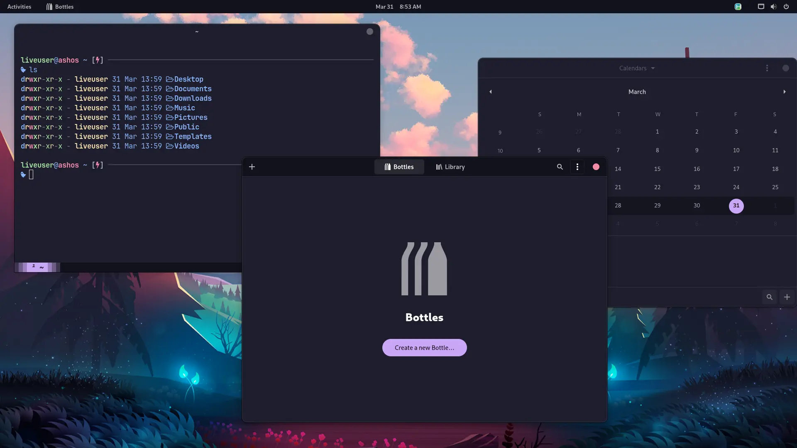

# Ash OS

    
    

&nbsp;
Ash OS is an Arch Linux based Linux distribution aimed towards lower-end systems. It aims to provide a better battery life and performance on such systems compared to other leading distributions. 

The project also aims to provide a seamless experience for systems to run Android and Windows applications out of the box without requiring additional configuration. 

## Contributing and development

To contribute to Ash OS, check out our [Wiki](https://github.com/ghostx31/ash-os/wiki) for contribution and development guidelines. 
